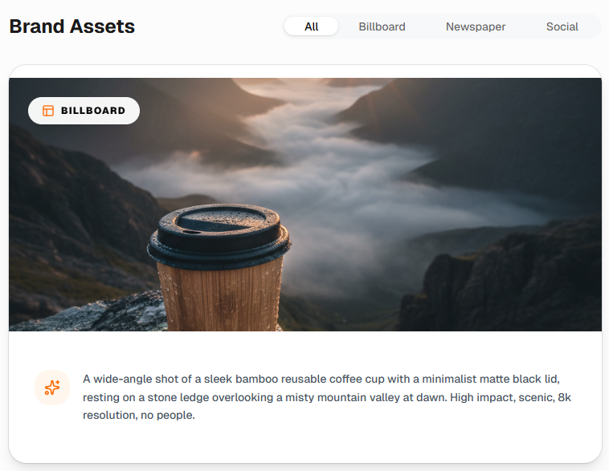

# ✨ Brand Builder

**Transform your product concepts into professional-grade creative assets.**  
Imagine your product across Billboards, Newspapers, and Social Media while maintaining perfect visual consistency.

---

## 🎨 Visual Showcase

<details>
<summary><b>📸 Hero Section & Input</b></summary>
<br>

</details>

<details>
<summary><b>🏙️ Billboard View</b></summary>
<br>

</details>

<details>
<summary><b>📰 Newspaper & Social Media</b></summary>
<br>

</details>

---

## 🚀 core Features

- **AI Creative Director**: Generates consistent visual identity using Gemini models.
- **Medium Contextualization**: Native support for Billboards, High-contrast Newsprints, and Lifestyle Social Posts.
- **Product-First Guardrails**: Strictly enforces a "No People" policy to keep focus on your product.
- **Enterprise-Ready Backend**: Secure proxy for OpenAI and Anthropic integrations.

## 🛠️ Tech Stack

| Layer | Technologies |
| :--- | :--- |
| **Frontend** | React 19, Vite, Tailwind CSS, Motion |
| **Backend** | Node.js, Express |
| **AI Models** | Gemini 2.0, Claude 3.5 Sonnet, GPT-4o, DALL-E 3 |
| **UI Components** | shadcn/ui, Lucide Icons |

---

## 🚦 Getting Started

### 1. Prerequisites
- **Node.js** (v18+) & **npm**
- [Google Gemini API Key](https://aistudio.google.com/app/apikey)

### 2. Setup
```bash
git clone <your-repo-url>
cd brand-builder-app
npm install
```

### 3. Configuration
Create a `.env` file and add your keys:
```env
GEMINI_API_KEY=your_key
# Optional: OPENAI_API_KEY, ANTHROPIC_API_KEY
```

### 4. Launch
```bash
npm run dev
```
Open [http://localhost:3000](http://localhost:3000)

---

## 📦 Production
```bash
npm run build
npm start
```
